# pyFU


pyFU is a simple set of python objects/scripts for extracting spectra from spectral images produced by (small) integral field unit (IFU) spectrographs.
The calibration and extraction parameters and IFU fibre properties (e.g. positions) are kept in a single YAML file, e.g.
```yaml
# example YAML file for pyFU
  tracer :
    width_maximum : 5
    width_centroid : 5
    trace_order : 5
    ampl_order : 5
  extractor :
    sigma : 3
    width_extract : 9
  ifu :
    number_fibres: 7
    slit: [f1,f2,f3,f4,f5,f6,f7]
    focal_positions :
      by_label:
        f1 : [0.0,0.0]
        f2 : [0.0,1.0]
        f3 : [0.0,-1.0]
        f4 : [0.866,0.5]
        f5 : [0.866,-0.5]
        f6 : [-0.866,0.5]
        f7 : [-0.866,-0.5]
```
(a full  YAML configuration file with all keywords is available in the distribution).

The package has been developed for rather low-resolution (R>1000) stable spectrographs that do not need wavelength calibrations during the night (most IFU spectrographs are fibre-coupled, after all).
A solar spectrum from the sky or from Moonlight is as good or a better wavelength calibrator (many more lines all over the spectrum) than a low-resolution arc-lamp in this case, and no special spectral line catalogue is needed.
Wavelength calibration is achieved by cross-correlating chunks of raw spectrum with a reference spectrum derived from a Solar atlas using an approximate wavelength calibration that the user must provide (e.g. by eye-balling the sky spectrum or an arc-lamp spectrum).
Unlike normal spectral packages, there is no software (yet!) for directly determining the wavelength calibration from arc-lamp spectra in pyFU, **pyFU** will let you import a simple CSV table containing the wavelengths and positions of lines determined elsewhere (e.g. in ds9 or using the pyFU display function) and calculate a wavelength calibration.  This can then be used as the intial solution for the solar solution.

The parameters for the IFU (number, positions, labels, and individual diameters of the fibres), traced spectral images (model for the positions and relative amplitudes of the spectra) or extracted spectra (labels of the original fibres) are kept within the FITS headers.
Rather than using hierarchical FITS keywords,
the information about individually traced spectra are coded into keyword names for each fibre and parameter
(e.g. the keyword for the 2nd coefficient of the position tracing polynomial of the 12th fibre is "TR-T0122"), but the format used to create the coding is also included in the header (e.g. "TR-TFORM" = "TR-{0:.3d}{1:1d}").
The final spectra are placed in a FITS binary table with multiple HDU's, one per spectrum (in addition to the table metadata HDU).
The FITS keywords and keyword formats can be configured at will; the defaults for these are kept in the file "defaults.py".
The current version does not yet support the subtraction of background scattered light.

This package is not intended to be used for massive IFU's (some of the python used is too slow) or really complicated spectral imaging (e.g. drastically different traces within the same spectral image).
If you have complicated data and/or want to reduce things by hand, there are much better packages like P3D (see Sandin et al., 2010, Astron. Ap. A35 and http://p3d.sourceforge.net).


## Installing pyFU

Copy the git-address above, go to the directory you want to install pyFU in, and type
```
$ git clone https://github.com/fhessman/pyFU.git
```
The required python packages are listed in the file requirements.txt
Install the package via
```shell
$ sudo python setup.py install
```

## Using pyFU from the command line

pyFU objects can be used from the command line, since each major sub-package contains a command-line version that performs that particular function and the setup script creates these scripts during installment: 
- ifucal (calib.py) : performs simple image calibration of a raw spectral image (bias,dark,flat)
- ifudis (display.py) : displays a spectra image or extracted spectra from a FITS file (not intended as a replacement for a real astronomical display programme like SAOImage or Topcat).
- ifuext (extract.py) : extracting the spectra from an image
- ifufak (fake.py) : creating test IFU images
- ifuima (image.py) : re-creating the focal-plane images from extracted spectra (either in pixels or in wavelength); requires that the configuration file contain the focal-plane positions.
- ifulam (lamp.py) : used to obtain a wavelength calibration from lamp spectra and a previous trace.
- ifureb (rebin.py) : rebin a spectrum to a particular (linear) dispersion relation and spectral resolution (used e.g. to create a Solar reference spectrum from a high-resolution Solar atlas)
- ifutra (trace.py) : tracing the individual spectra in the spectral image so that they can be extracted; either continuous spectra can be used (normal) or, via an external configuration file, individual lines in lamp spectra can be used
- ifuwav (wavcal.py) : wavelength calibration using sky spectra

If all the necessary information is contained within a YAML file, the normal reduction sequence can be as simple as:
```shell
$ ifucal --yaml myconfig.yaml
$ ifutra --yaml myconfig.yaml
$ ifuext --yaml myconfig.yaml
$ ifuwav --yaml myconfig.yaml
$ ifuima --yaml myconfig.yaml
```
which would produce a calibrated raw spectral image, the trace coefficients, the extracted pixel spectra (in a FITS binary table), the wavelength-calibrated spectra (in a FITS binary table), and a PNG image of the focal plane.
The results are documented using the standard python logging module.
Normally, one would want to use the "--show" or "--plot" flag in order to have intermediate results plotted (primitively, using standard matplotlib functionality and a minimum of additional interaction).
Some scripts have a "--details" flag to produce even more plots of intermediate steps.
Currently, some of the plots have a primitive matplotlib "menu" at the lower left with labels like "ABORT" or "SHOW RESULTS": simply press them to invoke their content when the graphics window is closed; these are obviously just debugging tools for what otherwise is intended to be an un-attended automatic pipeline.

Here are the command options and some information for each of the pyFU executable scripts.

<br/>

### ifucal (calib.py)

Performs a simple raw image calibration (bias, dark, flat) of raw spectral images.  The YAML configuration file can contain the list of raw calibration files necessary to create the master bias, dark, and flatfield files automatically.

To do a full pre-calibration from raw files, one could simply type something like
```shell
$ ifucal --infile ./raw/raw.fits --outfile ./calib/rawcalib.fits \\
      --subtract_bias --bias_files "./bias/bias*.fits" --masterbias ./bias/masterbias.fits \\
      --subtract_dark --dark_files "./dark/dark*.fits" --unitdark   ./dark/unitdark.fits \\
      --divide_flat   --flat_files "./flat/flat*.fits" --masterflat ./flat/masterflat.fits
```
which would result in the creation of the master calibration files as well as their use on the raw spectrum image.

WARNING: note the use of quotation marks to prevent your shell from expanding the file patterns!!!

The equivalent YAML entry would look like
```yaml
# mycalib.yaml
calib:
  infile:  ./raw/raw.fits
  outfile: ./calib/rawcalib.fits
  bias:
    subtract_bias: True
    infiles:       ./bias/bias*.fits
    masterbias:    ./bias/masterbias.fits
  dark:
    subtract_dark: True
    infiles:       ./dark/dark*.fits
    unitdark:      ./dark/unitdark.fits
  flat:
    divide_flat:   True
    infiles:       ./flat/flat*.fits
    masterbias:    ./flat/masterflat.fits
```
Note that the command line input has priority over the configuration file,
so that the following command would have the same effect as the previous one but for different input and output files:
```shell
$ ifucal --infile ./raw/raw2.fits --outfile ./calib/rawcalib2.fits --yaml mycalib.yaml
```
If the original command had been given, producing the master calibration files, then the second command would not
repeat their creation and only use the stored files.

CAUTION: currently, the BIASSEC and TRIMSEC options do not work!!

Syntax | Description
------ | -----------
--average, -A | average all of the input images (default False)
--biassec BIASSEC, -S BIASSEC | bias section x1,x2,y1,y2 (numpy coords; default None)
--bias\_files BIAS\_FILES, -1 BIAS\_FILES | pattern for raw bias pathnames (in quotes if pattern; default None)
--dark\_files DARK\_FILES, -2 DARK\_FILES | pattern for raw dark pathnames (in quotes if pattern; default None)
--divided\_by, -Q | divide the input image(s) by the other image(s)/a number (default False)
--divide\_flat, -F | divide image by master flat (default None)
--flat\_files FLAT\_FILES, -3 FLAT\_FILES | pattern for raw flat pathnames (in quotes if pattern; default None)
--generic GENERIC, -G GENERIC | output a generic calib yaml file (default None)
--infiles INFILES, -i INFILES | name of FITS image file(s) to process (in quotes if pattern; default None)
--masterbias MASTERBIAS, -b MASTERBIAS | pathname of master bias image (default None)
--masterflat MASTERFLAT, -f MASTERFLAT | pathname of master flatfield image (default None)
--millisec, -m | EXPTIME is in millisecs (default False)
--minus, -M | subtract other images/number from input images (default False)
--other OTHER, -O OTHER | pathname of other FITS image file or number, e.g. for arithmetic (default None)
--outfiles OUTFILES, -o OUTFILES | pathname of output FITS image file (in quotes if pattern; default None)
--plot, -p | plot details (default False)
--plus, -P | add other image to the input image (default False)
--start\_hdu START\_HDU, -0 START\_HDU | number of starting HDU in input files (default 0)
--subtract\_bias, -B | subtract master bias from image (default False)
--subtract\_dark, -D | subtract scaled unit dark from image (default False)
--sum, -S | sum all of the input images (default False)
--times, -X | multiply input images by the other images (default False)
--trimsec TRIMSEC, -T TRIMSEC | trim section x1,x2,y1,y2 (numpy coords; default None)
--unitdark UNITDARK, -d UNITDARK | pathname of unit dark image (default None)
--yaml YAML, -y YAML | global YAML configuration file for parameters


<br/>

### ifudis (display.py)

Displays IFU spectral images stored as FITS images or spectra stored in FITS binary tables.
Not intended to replace a decent display programme like SAOimage (for images) or Topcat (for tables), but just to be a quick possibility for displaying the data in the same matplotlib appearance used within the other pyFU modules when the "--plot" or "--show" options are chosen.

Syntax | Description
------ | -----------
--colourbar, -c | add colourbar
--fibre FIBRE, -F FIBRE | plot spectrum with this fibre label (default 0)
--hdu HDU, -H HDU | image HDU to display (default 0)
--images IMAGES, -i IMAGES | path(s) of input FITS image(s) (in quotes if pattern; default None)
--index INDEX, -I INDEX | index of spectrum (1,...,number) (default None)
--key KEY, -K KEY | FITS keyword for special selection (see --value) (default None; can use * as wildcard)
--labeled, -l | label the fibres (default False)
--metadata, -m | print out FITS header (default False)
--nobar, -n | do not add colourbar (default False)
--outfiles OUTFILES, -o OUTFILES | path(s) of output JPG,PNG,... image(s) (in quotes if pattern; default None)
--tables TABLES, -t TABLES | path(s) of input binary FITS table(s) (use quotes if pattern; default None)
--value VALUE, -V VALUE | FITS keyword value for special selection (default None)
--width WIDTH, -w WIDTH | display int width of given extraction band (default None)
--xcol XCOL, -x XCOL | name of x-column in table (default None)
--ycol YCOL, -y YCOL | name of y-column in table (default None)
--zmax ZMAX, -Z ZMAX | upper displayed value (default None)
--zmin ZMIN, -z ZMIN | lower displayed value (default None)

<br/>

### ifuext (extract.py)

Uses the fitted traces and widths stored either within a YAML file created by ifutra or contained within the FITS header of a file traced by ifutra to extract the spectra using a model of weighted Gaussian cross-sections.
The cross-section width of all spectral traces is globally fit to a polynomial sigma(x), where the width of fibres with different intrinsic diameters are simply scaled from this fitted width using the given relative intrinsic fibre diameters.
Formally, the weighted cross-sections are enough to remove cross-talk between neighboring fibres, but the greater the separation the better the cross-talk removal will be, since the profiles are not strictly Gaussians.

Syntax | Description
------ | -----------
--errcol ERRCOL, -E ERRCOL | name of flux error table column (default err_flux)
--vflip, -V | flip input image vertically before extracting (default False)
--flxcol FLXCOL, -F FLXCOL | name of flux table column (default flux)
--formats FORMATS, -f FORMATS | YAML configuation file for FITS keyword formats (default None)
--generic GENERIC, -G GENERIC | output a generic extraction yaml configuration file (default None)
--idxcol IDXCOL, -I IDXCOL | name of index table column (default index)
--infiles INFILES, -i INFILES | input FITS file names (in quotes if pattern; default None)
--keywords KEYWORDS, -K KEYWORDS | YAML configuation file for FITS keywords (default None)
--outfiles OUTFILES, -o OUTFILES | output FITS file names (in quotes if pattern; default None)
--pixcol PIXCOL, -P PIXCOL | name of pixel table column (default pixel)
--plot, -p | plot details (default False)
--trace TRACE, -T TRACE | path of (optional) YAML trace configuration file (default None)
--yaml YAML, -y YAML | path of (optional) generic YAML configuration file (default None)

<br/>

### ifufak (fake.py)

Creates a fake IFU spectral image using the IFU information in a YAML configuration file.
If no pattern spectrum is given, a fake absorption spectrum is created (normally, one would use the extracted Solar spectrum produced by ifusol).

Syntax | Description
------ | -----------
--full, -H | include full pyFU image header (default None)
--generic GENERIC, -G GENERIC | name of generic fake image configuration YAML file (default None)
--outfile OUTFILE, -o OUTFILE | path of (optional) output FITS file (default None)
--pattern PATTERN, -P PATTERN | pattern to use: solar|absorption|emission (default None)
--plot, -p | plot result (default False)
--yaml YAML, -y YAML | global YAML configuration file for parameters (default None)

<br/>

### ifuima (image.py)

Constructs a focal-plane image from a set of extracted spectra and the focal plan fibre positions in a YAML configuration file.
The pixel or wavelength range of the image can be given, depending upon whether the spectra are simply extracted or wavelength calibrated.

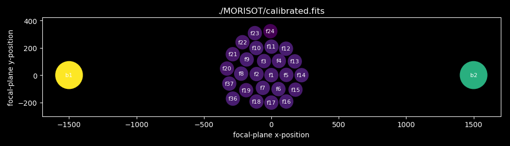

Syntax | Description
------ | -----------
--cmap CMAP, -c CMAP | matplotlib colour map name (default viridis)
--fudge FUDGE, -F FUDGE | fudge factor for setting the image window size (default 1.35)
--infiles INFILES, -i INFILES | input FITS table file(s) (in quotes if pattern; default None)
--info INFO, -I INFO | additional FITS keyword data to display in image (default [])
--labeled, -l | print fibre label on the fibre image (default False)
--logscale, -L | show IFU image using logarithmic intensity scaling (default False)
--outfiles OUTFILES, -o OUTFILES | output image file(s) (fits,png,jpg,...) (default None)
--pixels PIXELS, -x PIXELS | integration pixels of output image (default None)
--plot, -p | display resulting image (default False)
--scale, -s | scale fluxes by fibre area (show intensity, not flux) (default False)
--width WIDTH, -w WIDTH | width of plot [in] (default 9.0)
--waves WAVES, -W WAVES | integration wavelengths of output image (default None)
--yaml YAML, -y YAML | name of pyFU configuration file (default None)

Note: the YAML file is the only way to pass the positions of the fibres!

<br/>

### ifulam (lamp.py)

Wavelength calibration using extracted lamp spectra.  An external \*.csv is needed to indicate where the emission lines are (roughly) placed having the format, e.g.,
<pre>
     wavelength, xavg,      xleft,  dx
     -1,           58.024,    49,   18
     467.82,      301.987,   293,   18
     479.99,      394.055,   385,   18
     508.58,      613.191,   604,   18
     546.07,      906.215,   897,   18
     576.96,     1153.089,  1144,   18
     579.01,     1170.115,  1161,   18
     -23,        1713.007,  1704,   18
</pre>
The negative "wavelength" entries are ignored (an easy way to decide which lines are used).  The x-pixel windows used for each extracted lamp spectrum are defined by "xleft" and "dx", i.e. pixels xleft to xleft+dx.  Each extract lamp window is then fit with a Gaussian+continuum.

This method is a good way to obtain the initial wavelength solution needed for the solar spectrum cross-correlation method used in <tt>ifuwav</tt> (wavcal.py) and also yields an estimate for the spectroscopic resolution.

Syntax | Description
------ | -----------
--flxcol FLXCOL, -f FLXCOL | name of flux table columns (default flux)
--generic GENERIC, -G GENERIC | name of generic lamp calibration configuration YAML file (default None)
--infiles INFILES, -i INFILES | input FITS table(s) to be wavelength calibrated (in quotes if pattern; default None)
--model MODEL, -m MODEL | dispersion model (linear|quadratic|cubic|exp|power (default quadratic)
--outfiles OUTFILES, -o OUTFILES | output wavelength calibrated FITS table(s) (in quotes if pattern; default None)
--pause, -P | pause/prompt after every spectral calibration (default False)
--pixcol PIXCOL, -x PIXCOL | name of pixel table columns (default pixel)
--plot, -p | plot result (default False)
--save SAVE, -Y SAVE | YAML file for saving wavelength parameters (default None)
--trace TRACE, -T TRACE | pathname of YAML file containing trace (default None)
--wavcol WAVCOL, -W WAVCOL | name of output wavelength table column (default wavelength)
--wavetable WAVETABLE, -t WAVETABLE | name of CSV file containing (wavelength,xavg,xleft,dx) entries (default None)
--yaml YAML, -y YAML  | global YAML configuration file for parameters (default None)

<br/>

### ifureb (rebin.py)

Generic convolving/rebinning script to apply a lower-spectral resolution and/or a linear dispersion relation (via interpolation).
The number of pixels and pixel dispersion relation is defined by any two of 1) a given number of pixels, 2) a given constant dispersion, and/or 3) the wavelength limits.

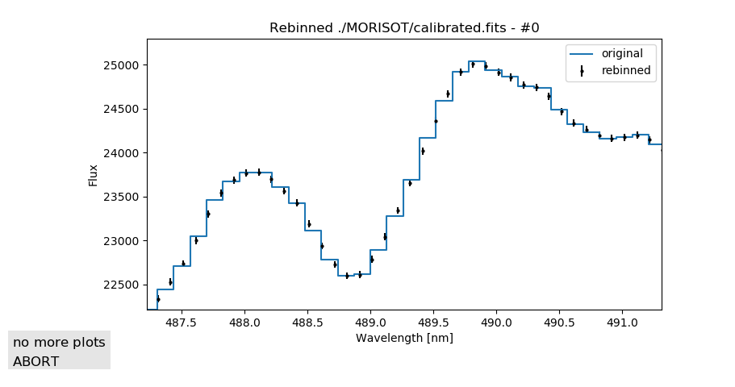

The ifusol command can be replaced by this command using the combination of appropriate arguments (keeping the former for historical reasons).

Syntax | Description
------ | -----------
--clobber, -c  |permit overwriting of tables (default False)
--dispersion DISPERSION, -d DISPERSION | output dispersion in nm/pixel (default None)
--errcol ERRCOL, -E ERRCOL | name of flux error column) (default err_flux)
--flxcol FLXCOL, -F FLXCOL | name of flux column) (default flux)
--generic GENERIC, -G GENERIC | name of generic rebin image configuration YAML file (default None)
--infiles INFILES, -i INFILES | input FITS binary table(s) containing spectra (in quotes if pattern; default None)
--limits LIMITS, -l LIMITS | wavelength limits w1,w2 [nm] of output spectrum (default None)
--npixels NPIXELS, -n NPIXELS | number of output pixels (default None)
--outfiles OUTFILES, -o OUTFILES | output FITS table(s) (in quotes if pattern; default None)
--plot, -p | plot result (default False)
--pixcol PIXCOL, -P PIXCOL | name of pixel column) (default pixel)
--title TITLE, -T TITLE | logging title) (default rebin)
--reference REFERENCE, -R REFERENCE | pathname of reference spectrum file (default None)
--wavcol WAVCOL, -w WAVCOL | name of wavelength column (default wavelength)
--wcol WCOL, -W WCOL  | name of wavelength column in reference (default wavelength)
--wresolution WRESOLUTION, -r WRESOLUTION | wavelength resolution to apply (default None)
--yaml YAML, -y YAML  | global YAML configuration file for parameters (default None)

<br/>

### ifusol (solar.py)

Convolves a high-resolution Solar spectrum to a lower resolution; for use as a wavelength- and flux-calibration spectrum.
The number of pixels and pixel dispersion relation is defined by any two of 1) a given number of pixels, 2) a given constant dispersion, and/or 3) the wavelength limits.

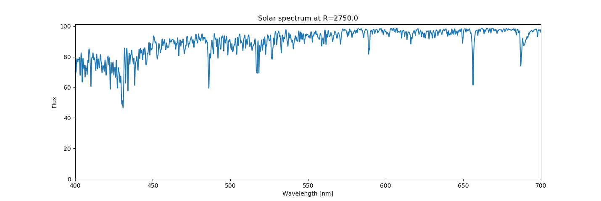

Syntax | Description
------ | -----------
--atlas ATLAS, -a ATLAS | input solar reference atlas (FITS table) (default None)
--dispersion DISPERSION, -d DISPERSION | output dispersion in nm/pixel (default None)
--fcol FCOL, -f FCOL  | name of input flux table column) (default flux)
--flxcol FLXCOL, -F FLXCOL | name of output flux table column) (default flux)
--generic GENERIC, -G GENERIC | name of generic solar spectrum configuration YAML file (default None)
--limits LIMITS, -l LIMITS | wavelength limits w1,w2 [nm] of output spectrum (default all)
--npixels NPIXELS, -n NPIXELS | number of output pixels (default None)
--outfile OUTFILE, -o OUTFILE | output FITS table (default None)
--plot, -p | plot result (default False)
--resolution RESOLUTION, -R RESOLUTION | spectral resolution R=lambda/dlambda (default <wave>/(3pix\*dispersion))
--wcol WCOL, -w WCOL  | name of input wavelength table column) (default wavelength)
--wavcol WAVCOL, -W WAVCOL | name of output wavelength table column) (default wavelength)
--wresolution WRESOLUTION, -r WRESOLUTION | wavelength resolution (default (3pix\*dispersion))
--yaml YAML, -y YAML |  global YAML configuration file for parameters (default None)

<br/>

### ifutra (trace.py)

Finds the spectra, fits a polynomial to their positions and relative amplitudes, and fits their cross-sectional widths as a function of horizontal pixel number.
This script has many options and parameters that determine how well an automatic tracing and hence finding of the individual spectra works.
For instance,
- the median separation between spectra can be given as a good starting value;
- the x-range of the tracing can be restricted if the spectra are weak on the left or right;
- the x-position of the starting trace can be given;
- the order of the polynomials fitting the spatial paths and amplitudes can be changed;
- the range of pixel deviations between different vertical slices can be adjusted;
- a constant image background can be removed (e.g. un-subtracted bias);
- a threshold above which local peaks (individual spectra) are detected can be given;
- the width of the centroid used to determine peaks in the slices can be given;
- ...

First, the local maxima in averaged vertical slices are found and the slices fit with Gaussians:
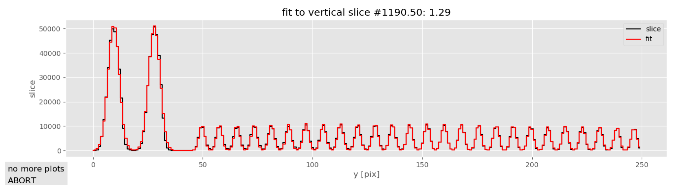

Then, the spectra widths are fit for their variation across the spectrum:

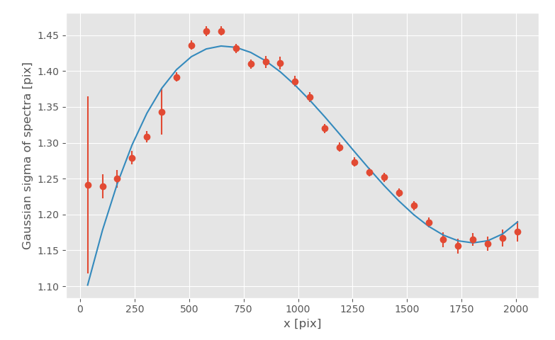

and the amplitudes along each spectrum are fit:

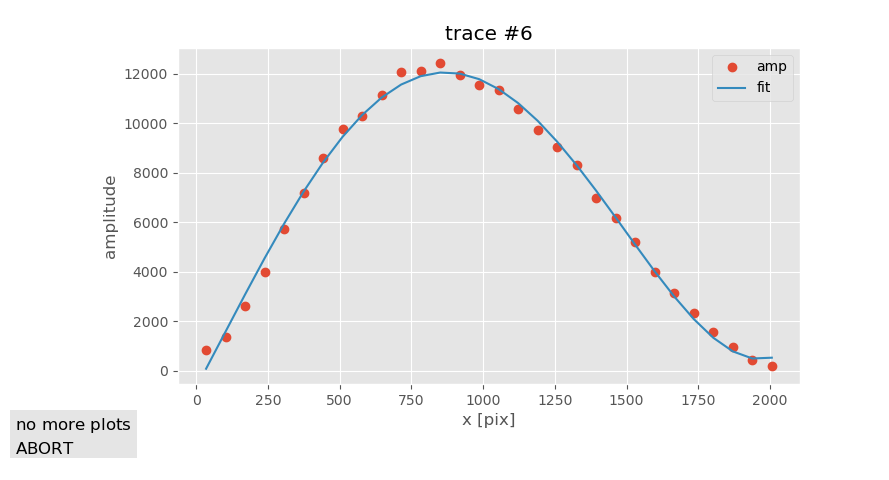

This results in a total fit of position and amplitude along  each traces spectrum:

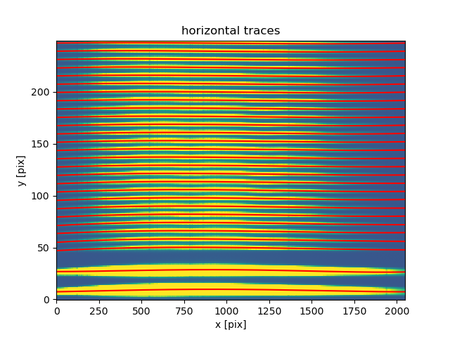


Syntax | Description
------ | -----------
--ampl\_model AMPL\_MODEL, -A AMPL\_MODEL | x model for traces ("polynomial"|"gaussians") (default polynomial)
--ampl\_order AMPL\_ORDER, -a AMPL\_ORDER | max. order of polynomial fit to spectra amplitudes (default None)
--bgk\_factor BGK\_FACTOR, -b BGK\_FACTOR | background factor (default 1)
--trace\_bias TRACE\_BIAS, -B TRACE\_BIAS | trace background bias level (default 0.0)
--details, -d | show details (default False)
--slices SLICES, -E SLICES | name of external CSV file with list of slice positions (xavg,xleft,dx) (default None)
--generic GENERIC, -G GENERIC | output generic trace configuration as a YAML file (default None)
--sigma SIGMA, -g SIGMA | Gaussian width of spectra (default 3)
--infile INFILE, -i INFILE | FITS file name (default ./spectra/test.fits) (default None)
--mid\_slice MID\_SLICE, -m MID\_SLICE | middle slice used to find spectra (default middle)
--number\_slices NUMBER\_SLICES, -N NUMBER\_SLICES | number of vertical slices (default 30)
--number\_fibres NUMBER\_FIBRES, -n NUMBER\_FIBRES | number of IFU fibres (default None)
--plot, -p | plot details (default False)
--sigma\_order SIGMA\_ORDER, -o SIGMA\_ORDER | Gaussian width of spectra (default None)
--trace\_order TRACE\_ORDER, -O TRACE\_ORDER | max. order of polynomial fit to spectra positions (default 5)
--window\_profile WINDOW\_PROFILE, -P WINDOW\_PROFILE | vertical profile window (default 9)
--dy\_min DY\_MIN, -s DY\_MIN | minimum expected spacing of spectra (default -4)
--dy\_max DY\_MAX, -S DY\_MAX | maximum expected spacing of spectra (default 4)
--number\_traces NUMBER\_TRACES, -T NUMBER\_TRACES | number of traced spectra (default None)
--window\_centroid WINDOW\_CENTROID, -W WINDOW\_CENTROID | width of centroid window (default 5)
--window\_max WINDOW\_MAX, -w WINDOW\_MAX | width of maximum search window (default 5)
--spacing SPACING, -x SPACING | vertical spacing of spectra (default 7)
--save SAVE, -Y SAVE  | pathname of output YAML file for trace coefficents (default None)
--yaml YAML, -y YAML  | global YAML configuration file for parameters (default None)

<br/>

### ifuwav (wavcal.py)

Uses a rough wavelength calibration and a known Solar spectrum convolved to the appropriate resolution to derive the wavelength calibration of an extracted spectrum.
The rough calibration is used to extract a chunk of spectrum at that mean wavelength from the Solar reference spectrum (extracted from a high-resolution Solar spectral atlas to match the resolution of the spectrum to be calibrated) and a chunk of uncalibrated spectrum roughly at that wavelength (depending upon the accuracy of the rough calibration).

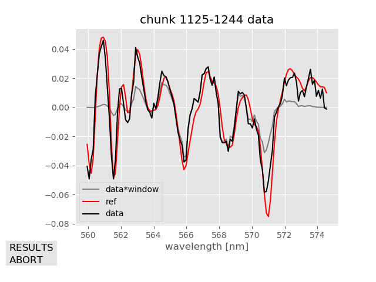

These chunks are then cross-correlated in order to find the pixel shift between the two chunks and hence the correction to the pixel(wavelength) calibration data.

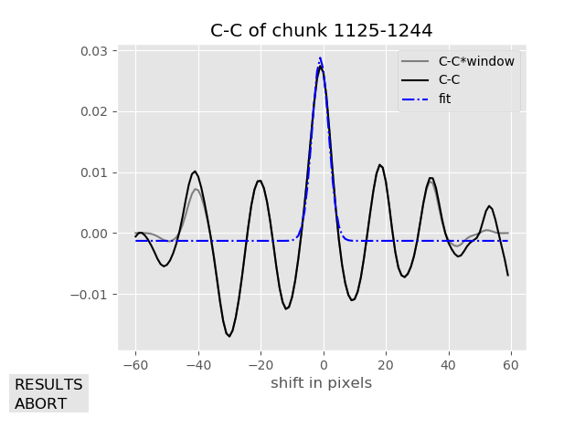

This data is then fit with a polynomial function, logarithmic function (where the velocity dispersion is constant) or exponential function (good for prism spectrographs) and applied to the extracted spectrum.  These dispersion functions are chosen so that they are analytically invertable (at least for polynomials up to 4th order).

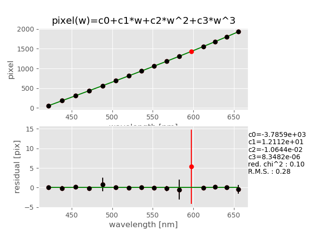

Since the wavelength calibration is done via cross-correlation with a Solar spectrum relative to the Solar absorption lines, one can optionally ("flux\_order" > 0) use the strengths of the lines as a measure of the flux-correction needed to bring the observed absorption lines to the same strength as those in the reference spectrum.
This correction factor is calculated for each wavelength chunk and can be fit with a polynomial (plain, Legendre, Laguerre or Hermite) to achieve a relatively good flux pre-calibration.

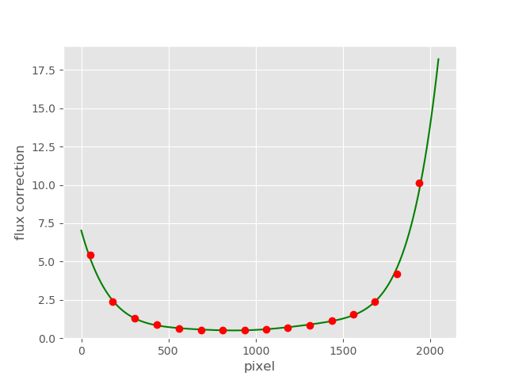

Syntax | Description
------ | -----------
--approx APPROX, -a APPROX | rough wavelength calibration w0,d0,... where wav ~ w0+d0\*pix+... (default None)
--copy COPY, -c COPY  | copy reference wavelength and flux calibration metadata to file (default None)
--fcol FCOL, -f FCOL  | name of flux table column in reference (default flux)
--flxcol FLXCOL, -F FLXCOL | name of output flux table column) (default flux)
--flux\_function FLUX\_FUNCTION, -X FLUX\_FUNCTION | function for flux-calibration; polynomial|legendre|laguerre|hermite (default None)
--flux\_order FLUX\_ORDER, -M FLUX\_ORDER | polynomial order for C-C flux-correction (default 5)
--generic GENERIC, -G GENERIC | output generic wavelength calibration configuration file (default None)
--infiles INFILES, -i INFILES | pathname(s) of input FITS or ascii table(s) (default None)
--in\_format IN\_FORMAT, -I IN\_FORMAT | optional format for finding spectrum in the pathname directory (default None)
--outfiles OUTFILES, -o OUTFILES | output FITS table(s) (default None)
--out\_format OUT\_FORMAT, -O OUT\_FORMAT | optional format for writing calibrated spectra to the pathname directory (default None)
--model MODEL, -m MODEL | model (linear|quadratic|cubic|exp|power (default linear)
--pause, -P | pause/prompt after every spectral calibration (default False)
--pixcol PIXCOL, -x PIXCOL | name of pixel table column in target (default pixel)
--plot, -p | plot result (default False)
--reference REFERENCE, -r REFERENCE | pathname of FITS reference spectrum (default None)
--save SAVE, -Y SAVE  | YAML file for saving wavelength parameters (default None)
--spacing SPACING, -s SPACING | spacing of cross-correlation windows [pix] (default 120)
--wave\_ranges WAVE\_RANGES, -R WAVE\_RANGES | wavelength ranges used l1,l2,l3,l4,... (default all)
--wcol WCOL, -w WCOL  | name of wavelength table column in reference (default wavelength)
--wavcol WAVCOL, -W WAVCOL | name of output wavelength table column (default wavelength)
--window\_cc WINDOW\_CC, -N WINDOW\_CC | size of cross-correlation windows [pix] (default 120)
--window\_centroid WINDOW\_CENTROID, -C WINDOW\_CENTROID | size of cross-correlation centroid window [pix] (default 11)
--yaml YAML, -y YAML  | global YAML configuration file for parameters (default None)

<br/>

### Example of using pyFU from the command line

Here's a simple example of how to use the command-line version of the scripts on pre-calibrated (bias, dark subtracted) data.
Let's assume you have 20x R=3000 spectra from 400-800nm with a mean dispersion of 0.1nm/pixel, mean spectrum vertical spacings of 8 pixels, spectrum widths of 2 pixels, and the following files :

Filename | Desscription
-------- | ------------
liege.fits | Copy of high-resolution Liege Solar Atlas as a FITS binary table with columns 'wavelength' and 'flux'
rawsky.fits | IFU spectral image of the daylight sky (bias- and dark-corrected)
raw.fits | IFU spectral image of your target

First, trace the sky spectrum to determine where the spectra are and how big their roughly Gaussian cross-section is.
```shell
$ ifutra --infile rawsky.fits --number_trace 20 --spacing 8 --sigma 2 --save trace.yaml
```
Here, the trace parameters are output to the YAML file "trace.yaml".

Next, let's extract the traced spectra into a FITS binary table:
```shell
$ ifuext --infile rawsky.fits --trace trace.yaml --outfile extsky.fits
```

In order to wavelength-calibrate these extracted spectra, we need a reference spectrum, here derived from our Liege spectral atlas:
```shell
$ ifusol --atlas liege.fits --resolution 3000 --dispersion 0.1 --limits 350,950 --outfile sun.fits
```

Now we can wavelength-calibrate the extracted spectra using our reference spectrum with the correct resolution:
```shell
$ ifuwav --infile extsky.fits --reference sun.fits --approx 400,0.1 --outfile sky.fits
```

Now we can extract the target data
```shell
$ ifuext --infile raw.fits --trace trace.yaml --outfile target.fits
```
and transfer the wavelength calibration and apply the flux-calibration stored in the calibrated sky.fits table via
```shell
$ ifuwav --infile target.fits --source sky.fits --outfile calibrated.fits
```

Finally, we can construct an Halpha focal-plane IFU image of the extracted, wavelength-calibrated data via
```shell
$ ifuima --infile calibrated.fits --wave1 656.0 --wave2 656.6 -outfile ifu.fits
```

The spectral images and individual spectra can be displayed via
```shell
$ ifudis --image raw.fits
$ ifudis --table calibrated.fits
```

<br/>

## Using pyFU objects and functions in your own programs

While the command-line versions are fine for testing, the whole purpose of pyFU is to build IFU pipelines.
Here is a simple example of such (with no error-handling!) using the components described above:

WORK-IN-PROGRESS: IGNORE THE FOLLOWING FOR NOW!

```python
import pyFU
import yaml
from astropy.io import fits

approx = [400.,0.1]	# APPROXIMATE DISPERSION RELATION

# GET THE BASIC CONFIGURATION
cfg = yaml.load('config.yaml')

# TRACE THE SPECTRA FROM A SKY IFU SPECTRUM IMAGE
skyhdu = fits.open ('rawsky.fits',mode='update')[0]
tracer = pyFU.trace.SpectrumTracer(skyhdu,config=cfg)
tracer.find_spectra()

# EXTRACT THE SKY SPECTRA
extractor = pyFU.extract.SpectrumExtractor (tracer,config=cfg)
sky = extractor.extract(skyhdu)

# WAVELENGTH CALIBRATE THE SKY SPECTRA
reftabs,refhdr = pyFU.utils.read_tables ('sun.fits')
retab = reftabs[0]
pyFU.wavcal.cc_calibrate_spectra (sky, reftab['wavelength'],reftab['flux'],approx=approx)

# EXTRACT AND WAVELENGTH CALIBRATE THE TARGET SPECTRA
targhdu = fits.open ('raw.fits',mode='update')[0]
target = extractor.extract(targhdu)
pyFU.wavcal.transfer_wavelengths_by_index (sky,target)

# PRODUCE A FOCAL PLANE IMAGE
img = pyFU.ifu...
```

<br/>

## pyfu_tool -- a simple tool for testing/configuring pyFU

The **pyfu_tool.py** script (installed as **ifutool**) is a simple command-line script designed to make it easier to test and configure *pyFU*.  The internal (YAML) configuration enables one to simplify the invocation of the pyFU commands.  For example, **ifucal** can be used to project an IFU image in the x-direction (e.g. to see the spatial separation of the fibres along the slit), divide an image by some long-term flat, or simply add up a long list of images:
```
$ ifucal --input a.fits --output b.fits --ymean
$ ifucal --input b.fits --output b_corr.fits --add --other ltflat.fits
$ ifucal --input "./raw/*.fits" --sum -output sum.fits
```
but in **ifutool** one can simply type
```
011> b.fits = xmean a.fits
012> b_corr.fits = b.fits / ltflat.fits
013> sum.fits = sum ./raw/*.fits
```
(the **ifutool** commands are numbered so that they can be invoked again by number).

The use of the **pyFU** calibration functionality is also simplified: if one wants to create a master bias image, one can either type
```
$ ifucal --bias_images "./bias/*.fits" --masterbias ./calib/masterbias.fits \
         --dark_images "./dark/*.fits" --unitdark   ./calib/unitdark.fits \
         --flat_iamges "./flat/*.fits" --masterflat ./calib/masterflat.fits
$ ifucal --inputs "./raw/*.fits" --masterbias ./calib/masterbias.fits \
         --unitdark ./calib/unitdark.fits --masterflat ./calib/masterflat.fits \
         --outputs "./reduced/red_*.fits"
```
or one can type
```
014> bias ./bias/*.fits ./calib/masterbias.fits
015> dark ./dark/*.fits ./calib/unitdark.fits
016> flat ./flat/*.fits ./calib/masterflat.fits
017> calib ./raw/*.fits ./reduced/red_*.fits
```

<br/>

## For maintainers and programmers

Each pyFU command script has the same basic structure to it's **main()** method:
- first, the command line options are defined in a dictionary, including things like types, default values, and the hierarchical position of quantities in the standard pyFU configuration dictionary'; e.g.
```
def main () :
	from pyFU.utils import parse_arguments, initialize_logging

    README = "Does blah."
    arguments = {
        'infile': {'path':'blah:','default':None, 'flg':'-i','type':str,'help':'path of (optional) input FITS table'},
        'outfile': {'path':'blah:','default':None, 'flg':'-o','type':str,'help':'path of (optional) output FITS table'},
        'verbose': {'path':None,'default':False, 'flg':'-V','type':bool,'help':'be verbose'},
        'yaml': {'path':None,'default':None, 'flg':'-y','type':str,'help':'global YAML configuration file for parameters'}
                }
```
The "path" key in each dictionary refers to the position of the dictionary entry in the pyFU configuration dictionary.  Here, e.g., the 'path':'blah:' entry for the "outfile" key means that the global configuration dictionary is expected to have a sub-directory with the key "blah", indicated by the colon in the string "blah:"; if the colon were missing, then "blah" would be a keyed value instead); this syntax enable the connection of all command line arguments to values anywhere within the pyFU configuration dictionary; note that the "verbose" dictionary indicates that the command line argument is not represented in the pyFU configuration dictionary - the path is None;
- the configuration dictionary is then passed to **parse_arguments()**, which returns the command line arguments (like argparse.ArgumentParser.parse_args()) and the parsed configuration dictionary (many default values are set in defaults.py); e.g.
```
        args,cfg = parse_arguments (arguments, readme=README)
```
- usually, the sub-dictionary for that function is selected for further use; e.g.
```
        info = cfg['blah'] # SUB-DICTIONARY IN THE GLOBAL CONFIG DICTIONARY
```
- global logging is then configured by **initialize_logging()**, generaly by using the configuration dictionary and it's 'logging' key, if present; e.g.
```
# ---- LOGGING
initialize_logging (config=cfg)
logging.info ('*************** some pyFU functionality **************')
```
- the dictionary is then used to prepare the input for the function (e.g. reading files); e.g.
```
        if args.verbose : print (f'reading {info['infile'])
        tab = Table.read (info['infile'],format='fits')
```
- the function is carried out; e.g.
```
        tab.meta['BLAH'] = 'blah'
        if args.verbose : print (f'writing {info['outfile'])
        tab.write (info['outfile'],format='fits')
```

